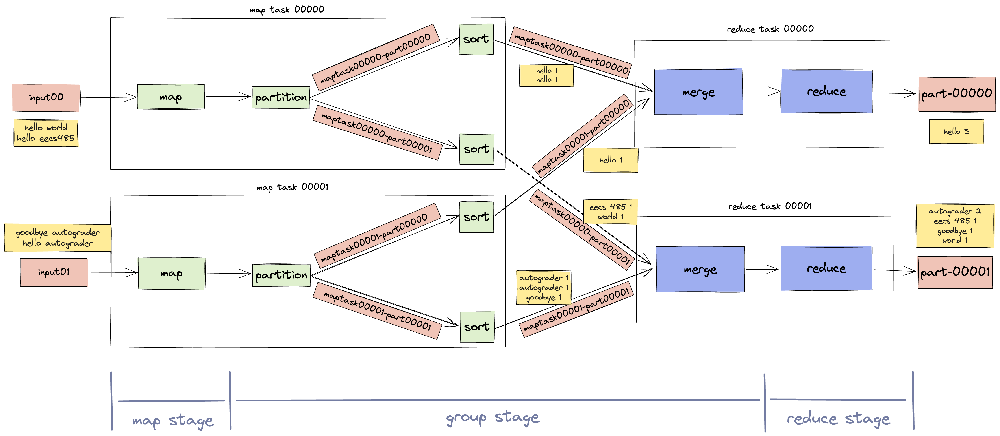

# fullstack-distributed-systems
I spearheaded the development of an Instagram-like web application that featured both client-side and server-side rendering, integrated with a MapReduce distributed system and a custom search engine. In compliance with the University of Michigan's honor code, I am not allowed to publicly disclose the source code. However, detailed descriptions of the project's key functionalities and technological implementations are provided below to illustrate the scope and depth of my technical capabilities.

## List of projects and their specifications
- [project 2: insta485-serverside](https://eecs485staff.github.io/p2-insta485-serverside/)
- [project 3: insta485-clientside](https://eecs485staff.github.io/p3-insta485-clientside/)
- [project 4: mapreduce distributed system](https://eecs485staff.github.io/p4-mapreduce/)
- [project 5: search engine](https://eecs485staff.github.io/p5-search-engine/)

## Project 2: insta485-serverside
This project represents the second installment of a three-part series in EECS 485, focused on developing a dynamic, interactive website modeled after Instagram. Leveraging server-side rendering, the application supports real-time interactions such as creating, updating, deleting, and liking posts, comments, and user profiles.

### Key Features
- **Dynamic Content Management**: Implement CRUD operations (Create, Read, Update, Delete) to manage posts, comments, likes, and user profiles dynamically.
- **Session Management**: Utilize sessions for managing user states across the application, ensuring a seamless and secure user experience.
- **Advanced SQL Database Interactions**: Employ basic SQL operations to handle data storage, retrieval, and real-time updates efficiently.
- **Interactive User Interface**: Integrate server-rendered pages with client-side interactions to create a responsive and intuitive user interface.
- **Authentication and Authorization**: Implement secure login mechanisms and ensure that pages redirect to login when the user is not authenticated.

## Project 3: insta485-clientside
This project is the culmination of the EECS 485 series, focusing on developing an interactive web application using client-side dynamic pages powered by a REST API. This Instagram clone transitions from server-side rendering in Project 2 to client-side rendering in Project 3, reusing and refactoring server-side code into RESTful services, with the frontend making AJAX calls to these services.

### Key Features
- **Client-Side Rendering**: Utilizes JavaScript to dynamically render content on the client side, ensuring a smooth user experience with reduced server load.
- **AJAX-driven Interactions**: Implements AJAX for asynchronous data fetching and updates, providing a seamless interaction without needing to reload the web page.
- **REST API Integration**: Develops and utilizes a RESTful API for handling data operations, allowing for scalable and maintainable code architecture.
- **Reusable Code**: Refactors existing server-side code from Project 2 to enhance functionality and adapt to a client-driven architecture.

### Implementation
- **JavaScript and AJAX**: Leverages advanced JavaScript and AJAX techniques for dynamic content management and real-time web page updates.
- **REST API Design**: Designs a comprehensive REST API that handles all back-end functionalities, including CRUD operations (Create, Read, Update, Delete) on posts, comments, and user profiles.
- **Asynchronous Programming**: Employs asynchronous programming paradigms to handle web requests efficiently, improving responsiveness and user experience.
- **Command Line Proficiency**: Enhances command-line skills through advanced project setup and development environment management.

## Project 4: mapreduce distributed system
This project implements a MapReduce framework in Python, inspired by Google's original MapReduce paper. Designed to execute MapReduce programs across distributed systems, the framework is capable of running on clusters managed by services such as AWS EMR, Google Dataproc, or Microsoft MapReduce. It leverages distributed processing to handle large-scale data processing tasks efficiently.

### Key Features
- **Distributed Execution**: Runs MapReduce jobs across multiple nodes to utilize the computational power of distributed systems.
- **Fault Tolerance**: Implements strategies to handle failures in the cluster, ensuring that the MapReduce job completes successfully despite system failures.
- **Concurrency**: Utilizes OS-provided concurrency facilities like threads and processes to manage multiple tasks simultaneously.
- **Networking with Sockets**: Uses socket programming to handle communication between the Manager and Workers, facilitating the coordination of distributed tasks.

### Implementation
- **Manager and Workers Architecture**: A Manager node coordinates the MapReduce jobs, distributing tasks among Worker nodes that execute the map and reduce functions.
- **Scalable Worker Instances**: Supports scaling up to multiple workers to increase processing power and reduce job completion time.
- **Interactive Job Submission**: Jobs can be submitted interactively through a command-line interface, providing users with a simple method to initiate and monitor MapReduce tasks.

## Project 5: search engine 
This project is designed to build a scalable search engine, similar to Google or Bing, utilizing advanced information retrieval techniques and parallel data processing. This system integrates text analysis, link analysis, and a service-oriented architecture to efficiently scale dynamic web pages and search functionalities.

### Key Features
- **Segmented Inverted Index**: Uses a pipeline of MapReduce programs to create a highly efficient indexed data structure for rapid query processing.
- **Text Analysis (TF-IDF)**: Implements Term Frequency-Inverse Document Frequency (TF-IDF) to evaluate the importance of a word in the context of a document or web page within the dataset.
- **Link Analysis (PageRank)**: Employs the PageRank algorithm to measure the link structure and determine the importance of each webpage.
- **REST API**: Develops an Index server that responds with search results in JSON format, allowing for easy integration and scalability.
- **Dynamic Search Interface**: Constructs a Search server that mimics the functionality of major search engines like Google or Bing, providing users with a familiar and efficient search experience.

### Implementation
- **MapReduce**: For parallel data processing and generation of indexed data.
- **Service-Oriented Architecture**: To ensure scalability and manage the dynamic aspects of the web search.
- **RESTful API**: To serve search results seamlessly across different platforms.

## Credits
- Team Members:
    - Jovan Yap
    - Liang Erdao
    - Gao Tianhong

## Acknowledgements
Special thanks to University of Michigan, my teammates and the EECS485 staffs for providing the resources and environment to develop this application.